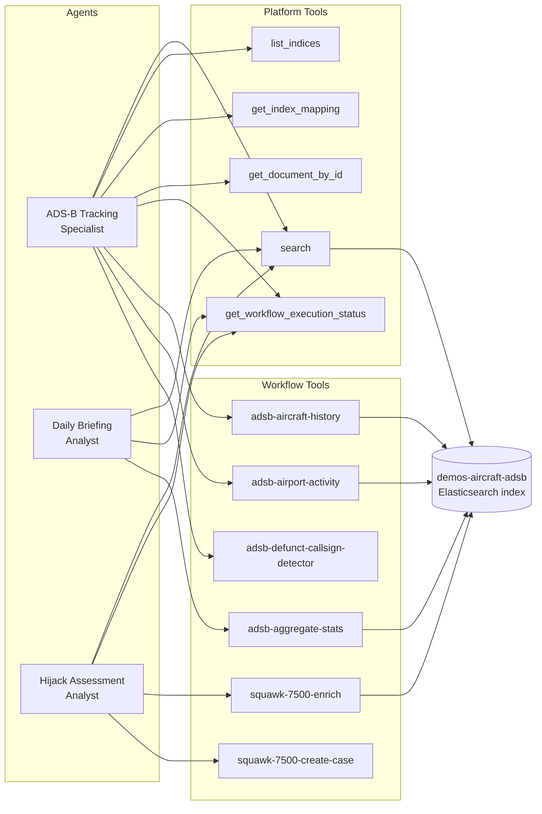
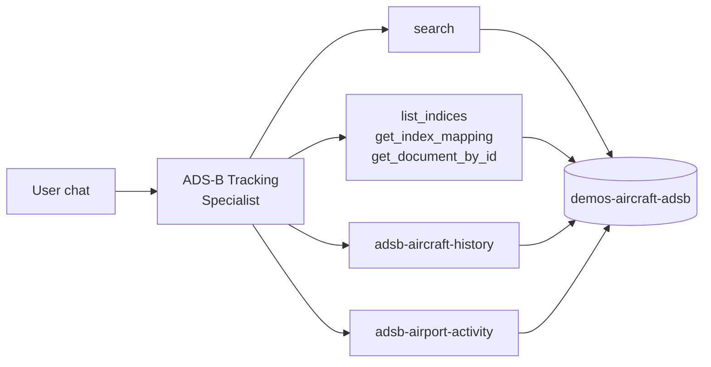
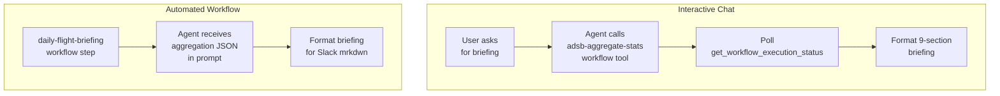
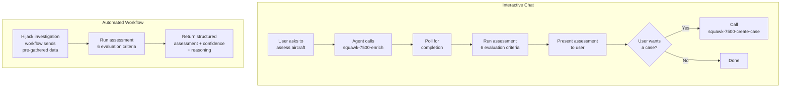

# Agents

This directory contains the Kibana Agent Builder definitions for the three
adsb-demo agents, along with their supporting **skills** and **tools** in the
subdirectories below.

```
elasticsearch/agents/    ← agent JSON (role-only instructions + skill_ids + tool_ids)
elasticsearch/skills/    ← skill JSON (domain mandates, formatting rules, tool guidance)
elasticsearch/tools/     ← tool JSON (workflow bindings with LLM routing descriptions)
```

## Layered Agent Format (9.4+)

Agents follow the Agent Builder 9.4 layered style. Rather than embedding all
guidance in the agent's `instructions` field, each agent carries a short
role-only prompt and references one or more **skills** via `skill_ids`. Skills
hold the domain-specific mandates, formatting rules, and tool-usage guidance.
**Tools** bind workflow IDs with descriptions that the LLM uses for routing.

```
Agent JSON          role-only persona + "follow guidance in your skills"
  └─ skill_ids  →  Skills JSON  full domain mandate (briefing format, triage
                                 runbook, field reference, counting rules…)
                     └─ tool_ids → Tools JSON  workflow binding + routing description
```

Agents are deployed by `setup.sh` in the order: workflows → tools → skills → agents.

Each JSON file in this directory defines a Kibana Agent Builder agent. Agents are
conversational AI assistants deployed to the Elastic Stack via `setup.sh` (or
`make setup`). Once deployed, they are accessible through the Agent Builder chat
interface in Kibana, where users can ask questions and trigger workflow tools
directly from the conversation.

## Inventory

| File                                | Agent ID                       | Purpose                                                          |
| ----------------------------------- | ------------------------------ | ---------------------------------------------------------------- |
| `adsb-agent.json`                   | `adsb_agent`                   | General-purpose flight tracking and ad-hoc ADS-B queries         |
| `adsb-daily-briefing-agent.json`    | `adsb_daily_briefing_agent`    | Generate and discuss daily ADS-B flight briefings                |
| `adsb-hijack-assessment-agent.json` | `adsb_hijack_assessment_agent` | Assess squawk 7500 (hijack) signals as genuine or false positive |

## System overview

The diagram below shows how the three agents relate to their tools, workflow
integrations, and the underlying data.



> Platform tools are built-in Kibana APIs. Workflow tools are Kibana Workflows
> registered as callable tools -- see the
> [workflows README](../workflows/README.md) for full details on each workflow.

______________________________________________________________________

## 1. Aircraft ADS-B Tracking Specialist

**File:** `adsb-agent.json`
**Agent ID:** `adsb_agent`
**Labels:** `adsb`, `aircraft`, `Demo`
**Index:** `demos-aircraft-adsb`

A general-purpose agent for querying and analysing live ADS-B flight data. It
has direct access to Elasticsearch platform tools for ad-hoc queries and workflow
tools for structured reports: per-aircraft history, per-airport activity, and
defunct callsign detection.

**Skill:** `adsb-tracking-specialist-skill` (field reference, tool guidance,
aircraft/airport/defunct report formats, enrichment cache fallback patterns)

**Tools:**

| Tool                                          | Purpose                                           |
| --------------------------------------------- | ------------------------------------------------- |
| `platform.core.search`                        | Query the ADS-B index                             |
| `platform.core.list_indices`                  | Discover available indices                        |
| `platform.core.get_index_mapping`             | Inspect field mappings                            |
| `platform.core.get_document_by_id`            | Fetch a single document                           |
| `platform.core.get_workflow_execution_status` | Check workflow run status                         |
| `adsb-aircraft-history`                       | Aircraft history report (aggregations + external) |
| `adsb-airport-activity`                       | Airport activity report (ES\|QL)                  |
| `adsb-defunct-callsign-detector`              | Detect defunct airline callsign prefixes (ES\|QL) |

**Capabilities:**

- Locate aircraft by callsign, ICAO24 address, or geographic region
- Filter by altitude ranges, speed, heading, climb/descent rate
- Distinguish airborne vs ground aircraft
- Run aggregations (flights by country, region, altitude bands)
- Execute geospatial queries (bounding box, radius)
- Track aircraft movements over time
- Generate structured aircraft history reports (via `adsb-aircraft-history`)
- Generate structured airport activity reports (via `adsb-airport-activity`)
- Detect aircraft using callsign prefixes from known defunct airlines (via `adsb-defunct-callsign-detector`)



______________________________________________________________________

## 2. ADS-B Daily Briefing Analyst

**File:** `adsb-daily-briefing-agent.json`
**Agent ID:** `adsb_daily_briefing_agent`
**Labels:** `adsb`, `workflow`, `briefing`, `Demo`
**Avatar:** purple (`#6f42c1`), symbol **DB**
**Index:** `demos-aircraft-adsb`

Generates structured daily flight briefings from 24-hour ADS-B aggregations. In
interactive chat, it calls the `adsb-aggregate-stats` and `hijack-cases-summary`
workflow tools to fetch data, polls for completion, then formats an 11-section
briefing. It can also answer follow-up questions about specific airports,
regions, or anomalies using direct search.

This agent is also invoked automatically by the `daily-flight-briefing` workflow
as an `ai.agent` step -- in that path, aggregation results are passed directly
in the prompt and the agent formats them for Slack (single message).

**Skill:** `adsb-briefing-analyst-skill` (briefing format mandate, section
rules, Slack mrkdwn guidance, counting rules)

**Tools:**

| Tool                                          | Purpose                                |
| --------------------------------------------- | -------------------------------------- |
| `platform.core.search`                        | Ad-hoc queries for follow-up questions |
| `platform.core.get_workflow_execution_status` | Poll workflow completion               |
| `adsb-aggregate-stats`                        | Trigger 24h aggregation workflow       |
| `hijack-cases-summary`                        | Fetch squawk 7500 investigation cases  |

**Briefing sections:**

01. Executive summary (unique aircraft, exclusively-airborne count)
02. Top 5 busiest airports (IATA + full name, unique flights)
03. Top 5 origin countries (unique aircraft)
04. Airport zone activity (arriving, departing, taxiing, overflight, at_airport)
05. Regional traffic (top 10 UN subregions)
06. Continent overview
07. Ground vs airborne (overlapping buckets; exclusively-airborne highlighted)
08. Emergency squawks (7500, 7600, 7700)
09. Notable findings
10. Hijack investigation outcomes
11. Defunct callsign detections



______________________________________________________________________

## 3. Squawk 7500 Hijack Assessment Analyst

**File:** `adsb-hijack-assessment-agent.json`
**Agent ID:** `adsb_hijack_assessment_agent`
**Labels:** `adsb`, `squawk-7500`, `security`, `Demo`
**Avatar:** red (`#dc3545`), symbol **HA**
**Index:** `demos-aircraft-adsb`

An aviation security analyst that evaluates whether a squawk 7500 (hijack)
transponder code is genuine or a false positive. It uses flight history,
aircraft registry data, live tracking cross-references, and news search to
build an evidence-based assessment.

**Skill:** `adsb-hijack-assessment-skill` (triage runbook, evaluation criteria,
confidence scoring, output format, case-creation guidance, enrichment cache
fallback)

**Tools:**

| Tool                                          | Purpose                                                   |
| --------------------------------------------- | --------------------------------------------------------- |
| `platform.core.search`                        | Ad-hoc queries against ADS-B data                         |
| `platform.core.get_workflow_execution_status` | Poll workflow completion                                  |
| `squawk-7500-enrich`                          | Gather flight history, adsbdb, adsb.lol, GNews data       |
| `squawk-7500-create-case`                     | Create or update a Kibana case with the triage assessment |

### Operating modes

This agent operates in two distinct modes depending on how it is invoked.

**Interactive chat** -- a user asks the agent to assess a specific aircraft. The
agent calls the `squawk-7500-enrich` workflow tool, polls for results, runs its
assessment, and presents the triage assessment. It then offers to open a Kibana
case via the `squawk-7500-create-case` workflow tool if the user requests it.

**Automated workflow** -- the `squawk-7500-hijack-investigation` workflow calls
this agent as an `ai.agent` step with all enrichment data pre-gathered in the
prompt. The agent skips tool calls, assesses directly, and returns a structured
assessment so the workflow can route it.



### Evaluation criteria

The agent considers these factors in order of importance:

1. **Ground status and airport proximity** -- aircraft on the ground or at very
   low altitude near an airport is a strong false-positive indicator
   (maintenance, ground testing, student pilot).
2. **Expected route vs actual position** -- significant deviation from the
   adsbdb expected route could indicate forced diversion.
3. **Flight dynamics** -- unusual altitude changes, erratic heading shifts, or
   abnormal speed variations in the 6-hour flight history.
4. **Independent confirmation** -- whether adsb.lol independently shows squawk
   7500, or if only local receivers see it (possible receiver artefact).
5. **News corroboration** -- GNews articles mentioning the flight or a hijack
   event provide strong evidence.
6. **Aircraft type and operator** -- commercial airline flights receive higher
   scrutiny than small private or training aircraft.

### Output format

Every assessment includes three fields:

- **AI Triage Assessment:** `genuine` or `false_positive`
- **Confidence:** a number between 0 and 1
- **Reasoning:** a concise paragraph referencing specific evidence

When called from the automated workflow, the `**AI Triage Assessment:**` line is
parsed to route genuine threats vs false positives.

______________________________________________________________________

## Deployment

All three agents and their supporting skills and tools are deployed by `setup.sh`:

```bash
# Deploy everything
make setup

# Deploy the full AI layer (workflows + tools + skills + agents)
./setup.sh --only workflows,tools,skills,agents

# Re-deploy agents only (tools and skills must already exist)
./setup.sh --only agents --force

# Re-deploy tools and skills only
./setup.sh --only tools,skills --force
```

The deploy order matters: workflows must exist before tools (tools need the live
workflow UUID), and skills must exist before agents (agents reference skill IDs).
The full `make setup` handles this automatically.

See the project [README](../../README.md) and [AGENTS.md](../../AGENTS.md) for
full setup instructions, and the [workflows README](../workflows/README.md) for
details on the workflow tools each agent uses.

## Skills

Skills are defined in [`../skills/`](../skills/). Each skill has:

- `id` — matches the `skill_ids` entry in the agent JSON
- `name` / `description` — used by the LLM for skill routing
- `content` — Markdown document with the full domain mandate
- `tool_ids` — tools available within this skill's scope

| Skill file | Agent | Content |
| ---- | ----- | ------- |
| `adsb-briefing-analyst-skill.json` | `adsb_daily_briefing_agent` | Briefing format mandate (all 11 sections, counting rules, Slack mrkdwn) |
| `adsb-tracking-specialist-skill.json` | `adsb_agent` | Field reference, aircraft/airport/defunct tool guidance, report formats |
| `adsb-hijack-assessment-skill.json` | `adsb_hijack_assessment_agent` | Squawk 7500 triage runbook, evaluation criteria, confidence scoring |

## Tools

Workflow tools are defined in [`../tools/`](../tools/). Each tool JSON has:

- `id` — matches the `tool_ids` entry in agent/skill JSON
- `type: "workflow"` — all tools are workflow bindings
- `description` — the LLM's routing signal (scenario-oriented)
- `tags` — for discoverability
- `configuration.workflow_id` — placeholder replaced at deploy time with live UUID

| Tool file | Workflow bound |
| ---- | -------------- |
| `adsb-aggregate-stats.json` | ADS-B Aggregate Stats |
| `adsb-aircraft-history.json` | ADS-B Aircraft History Report |
| `adsb-airport-activity.json` | ADS-B Airport Activity Report |
| `adsb-defunct-callsign-detector.json` | Defunct Callsign Detector |
| `hijack-cases-summary.json` | Hijack Cases Summary |
| `squawk-7500-enrich.json` | Squawk 7500 Enrich |
| `squawk-7500-create-case.json` | Squawk 7500 Create Case |
